# Production-Ready: Close All Gaps + Modern Apple Best Practices

---

## Phase 0: Modernize to Latest Platform Standards

### 0A. Enable Swift 6 Strict Concurrency

The codebase mixes `ObservableObject`/`@Published`/`@StateObject` (old pattern) with `@Observable` (new pattern). Standardize on the modern stack.

**Files using legacy observation (must migrate):**
- [RitualPageView.swift](Meditation Builder/Views/RitualPageView.swift) -- `RitualPageViewModel: ObservableObject` with `@Published` and `@StateObject`
- [RoutineDataManager.swift](Meditation Builder/Models/RoutineDataManager.swift) -- `class RoutineDataManager: ObservableObject`
- [AuditoriumManager.swift](Meditation Builder/Views/Components/AuditoriumManager.swift) -- `class AuditoriumEngine: ObservableObject`
- [Logger.swift](Meditation Builder/Utils/Logger.swift) -- `class AppLogger: ObservableObject` with `@Published`
- [Meditation_BuilderApp.swift](Meditation Builder/Meditation_BuilderApp.swift) -- `@StateObject private var appLogger`

**Migration per type:**
- Replace `ObservableObject` + `@Published` with `@Observable` macro
- Replace `@StateObject` with `@State` at call sites
- Replace `@ObservedObject` with `@Bindable` where mutation is needed, or direct property access where read-only
- `RoutineDataManager`: convert to `actor` (it manages `ModelContext` which should be serialized). Keep `@MainActor` on UI-facing computed properties. Use `nonisolated` for pure helpers
- Mark value types (`SessionEvent`, `SessionStatistics`, `RoutineBlock`, `Routine`) as `Sendable`
- Enable **Strict Concurrency Checking = Complete** in Xcode build settings
- Use `@preconcurrency import` for any third-party modules not yet migrated

### 0B. Replace Dragula with Native SwiftUI Drag-and-Drop

The app targets iOS 18.5. SwiftUI natively supports reorder via `List($items, editActions: .move)` and `draggable`/`dropDestination` modifiers (available since iOS 16). The third-party **Dragula** SPM package is unnecessary.

**Current usage** in [RoutineBuilderView.swift](Meditation Builder/Views/RoutineBuilderView.swift):
```swift
import Dragula
DragulaView(items: $routine.blocks) { block in
    SwipeableBlockCard(...)
}
```

**Migration:**
- Remove `import Dragula` from `RoutineBuilderView.swift` and `RoutineModels.swift`
- Remove `DragulaItem` conformance from `MeditationBlock` and `RoutineBlock`
- Remove Dragula SPM dependency from `Package.resolved` and `project.pbxproj`
- Replace `DragulaView` with `ForEach` + `.onMove` handler, or use the iOS 18 `dragContainer(for:in:selection:)` + `draggable(containerItemID:)` APIs for richer drag within `LazyVStack`
- Remove the `dragulaKey = UUID()` force-refresh hack (native reorder doesn't need it)

### 0C. SwiftData Schema Versioning

Production apps **must** version their SwiftData schema from day one to avoid data loss on model changes. Currently there is no `VersionedSchema` or `SchemaMigrationPlan`.

**Implementation:**
- Create `SchemaV1` as a `VersionedSchema` containing the current 6 models (`SavedRoutine`, `MeditationBlock`, `MediaResource`, `MeditationSession`, `SessionBlockRecord`, `Theme`)
- Create `MeditationMigrationPlan: SchemaMigrationPlan` with `schemas = [SchemaV1.self]` and empty `stages` (baseline)
- Update `ModelContainer` init in [Meditation_BuilderApp.swift](Meditation Builder/Meditation_BuilderApp.swift) to use the migration plan
- Future model changes create `SchemaV2` with a `.lightweight(fromVersion:toVersion:)` or custom `MigrationStage`

File: new `Models/SchemaVersioning.swift`

### 0D. AVAudioSession Background Playback

For a meditation app, audio must continue when the screen locks or the app is backgrounded.

- Add `audio` to `UIBackgroundModes` in [Meditation-Builder-Info.plist](Meditation-Builder-Info.plist)
- Configure `AVAudioSession.sharedInstance()` with category `.playback` and `setActive(true)` at engine startup
- Handle `AVAudioSession.interruptionNotification` (phone calls, Siri) -- pause engine on `.began`, resume on `.ended` with `.shouldResume`
- Handle `AVAudioSession.routeChangeNotification` for headphone disconnect (pause playback)

Apply in the consolidated `AuditoriumEngine` (step 1) and the new `AmbientSoundEngine` (step 6).

---

## Phase 1: Quick Fixes

### 1. Consolidate Duplicate Audio Engine

Filenames and class names are **swapped**: `AuditoriumEngine.swift` declares `class AuditoriumManager`, `AuditoriumManager.swift` declares `class AuditoriumEngine`. Only `AuditoriumEngine` is used.

- **Delete** `AuditoriumEngine.swift` (the unused `AuditoriumManager` class)
- **Rename** `AuditoriumManager.swift` to `AuditoriumEngine.swift`
- Migrate from `ObservableObject` to `@Observable` (part of 0A)
- Fix `print("[AuditoriumManager]"...)` prefixes to `[AuditoriumEngine]`; replace `print` with `AppLogger`
- Add `AVAudioSession` configuration per 0D

### 2. Register `Theme` + Schema Versioning

In [Meditation_BuilderApp.swift](Meditation Builder/Meditation_BuilderApp.swift), add `Theme.self` to the schema. Wrap all models in `VersionedSchema` per 0C.

### 3. Fix MainTabView Navigation Callbacks

The three stubs in [MainTabView.swift](Meditation Builder/Views/MainTabView.swift) just call `navigationPath.removeLast()`.

- Add `@State private var routineToEdit: SavedRoutine?`, `routineToDelete: SavedRoutine?`, `routineToPlay: SavedRoutine?`
- In each callback: pop path **and** set the corresponding state
- Attach `.sheet(item: $routineToEdit)` -> `RoutineBuilderView(editingRoutine:)`
- Attach `.confirmationDialog` for delete -> `RoutineDataManager.shared.deleteRoutine(...)`
- Attach `.fullScreenCover(item: $routineToPlay)` -> `RoutinePlayerView` with selected routine

### 4. Remove Legacy Session Tracking

The player uses only the event-based `SessionRecord` path.

- **Delete** the 3 deprecated methods in [RoutineDataManager.swift](Meditation Builder/Models/RoutineDataManager.swift): `createSession(for:startTime:)`, `startBlock(_:in:startTime:)`, `endBlock(_:in:endTime:wasSkipped:actualDuration:)`
- **Delete** the legacy `completeSession(_ session:...)` overload
- Gate `isDebugMode` branches behind `#if DEBUG`
- Replace all `print(...)` with `AppLogger` calls
- Search and remove any remaining callers

### 5. Clean Up Playground / Debug Artifacts

- Wrap [AnimationPlaygroundView.swift](Meditation Builder/Views/Playground/AnimationPlaygroundView.swift), [FinalAnimationFile.swift](Meditation Builder/Views/Playground/FinalAnimationFile.swift), [AudioTest.swift](Meditation Builder/Views/Playground/AudioTest.swift) in `#if DEBUG`
- Remove commented-out `PlaceholderView` / `AudioTestView` lines in `MainTabView.swift`
- Fix `LogViewerView` undeclared `logger` property

---

## Phase 2: New Features

### 6. Build Ambient Sound Mixer (Sounds Tab)

Replace `MeditationAnimationPlayground()` with `AmbientSoundMixerView`.

**Scope:**
- Curated ambient sounds: rain, forest, ocean, wind, fire, singing bowls, white noise
- Per-sound toggle + volume slider, master volume control
- `AmbientSoundEngine` using multiple `AVAudioPlayerNode`s on a shared `AVAudioEngine`, with proper `AVAudioSession` `.playback` config (0D)
- Use `@Observable` for the view model
- Persist active mix via `@AppStorage` / `UserDefaults`
- Integrate with meditation player: ambient continues under bells

**Files:**
- New: `Views/AmbientSoundMixerView.swift`
- New: `Models/AmbientSoundEngine.swift`
- New: audio loop assets in `Audio/ambient/`
- Edit [MainTabView.swift](Meditation Builder/Views/MainTabView.swift): swap `.music` case
- Edit [CustomTabBar.swift](Meditation Builder/Views/Components/CustomTabBar.swift): rename "Music" to "Sounds", icon `waveform`

### 7. Build Full Settings Screen

Replace `LoggingSettingsView()` with `SettingsView`.

**Sections:**
- **Appearance:** Dark/light/system via `@AppStorage("colorScheme")`, accent color picker
- **Notifications:** Daily reminder toggle + time picker using `UNUserNotificationCenter`
  - Request permission only after user enables the toggle (not at launch)
  - Use `UNCalendarNotificationTrigger` with `repeats: true`
  - Stable identifier `"meditation-daily-reminder"` for update/cancel
  - Handle foreground display via `UNUserNotificationCenterDelegate.willPresent`
- **Defaults:** Default routine duration, default bell sound
- **Data:** Export sessions as JSON (`Codable` + `ShareLink`), import, clear all (with `.confirmationDialog`)
- **About:** Version from `Bundle.main`, credits, privacy link
- **Developer:** Collapsible section embedding `LoggingSettingsView`

**Files:**
- New: `Views/SettingsView.swift`
- New: `Models/NotificationManager.swift` (use `@Observable`)
- Edit [MainTabView.swift](Meditation Builder/Views/MainTabView.swift): swap `.settings` case

---

## Phase 3: Finalize

### 8. Update README

Rewrite [README.md](README.md):
- Core Data -> SwiftData with VersionedSchema
- iOS 17 -> iOS 18.5
- File names: `RoutineModels.swift`, `SessionModels.swift`
- Session model: `MeditationSession` + `SessionRecord`
- Tab structure: Library, Sounds, Timer, History, Settings
- Swift 6 concurrency, `@Observable`, native drag-and-drop
- Remove aspirational features not in v1
- Add build instructions (Xcode version, iOS target)

### 9. Add Test Target (Swift Testing Framework)

Use the modern **Swift Testing** framework (`@Test`, `#expect`) instead of `XCTest`. Swift Testing natively supports `@MainActor` and `async` test functions.

- Add `Meditation BuilderTests` target
- Unit tests:
  - `RoutineDataManager`: CRUD, event-based session completion, `reconstructBlockLogs`, statistics
  - `SessionRecord`: `calculateActualMeditationTime`, `getPauseIntervals`, event ordering
  - `MeditationSession`: `completeSession`, block completion counting, overshoot
  - `RoutinePlayerViewModel`: state transitions (start, pause, resume, end)
  - `AmbientSoundEngine`: mix persistence, volume state
  - `NotificationManager`: schedule/cancel/update reminder
- Use `@Test(.tags(.model))` for organization
- In-memory `ModelContainer` for SwiftData tests (no on-disk side effects)

---

## Execution Order

```mermaid
gantt
    title Implementation Order
    dateFormat X
    axisFormat %s
    section Modernize
        Swift6Concurrency           :m1, 0, 3
        ReplaceDragula              :m2, 0, 2
        SchemaVersioning            :m3, 0, 1
        BackgroundAudio             :m4, 0, 1
    section QuickFixes
        ConsolidateAudioEngine      :a1, 3, 4
        RegisterThemeSchema         :a2, 1, 2
        FixNavCallbacks             :a3, 3, 5
        RemoveLegacySession         :a4, 3, 5
        CleanPlaygroundDebug        :a5, 3, 4
    section Features
        AmbientSoundMixer           :b1, 5, 9
        FullSettingsScreen          :b2, 5, 8
    section Finalize
        AddTestTarget               :c1, 5, 9
        UpdateREADME                :c2, 9, 10
```



**Key dependency:** Swift 6 / `@Observable` migration (m1) must land before consolidating the audio engine (a1) and building new features (b1, b2), since those will use the modern patterns from the start.
